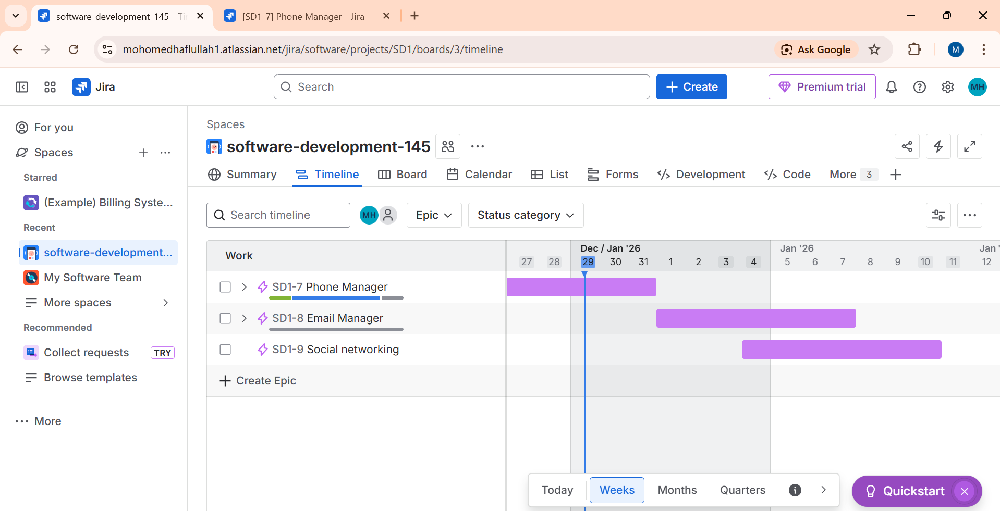
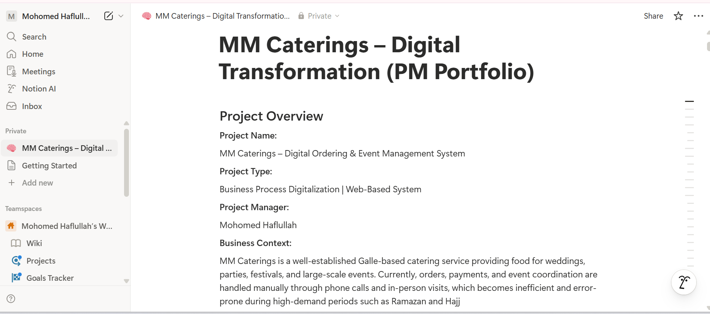

# Mohomed Haflullah

Project Management Intern | Agile & PMO Support  
IT Undergraduate | Client-Based Delivery & Digital Transformation Projects  
Preparing for Project Management Opportunities in Dubai

---

## About Me
I am an early-career Project Management professional with hands-on experience supporting Agile delivery, PMO coordination, and client-based digital transformation initiatives. My background combines structured project execution, stakeholder communication, and practical use of industry-standard tools across technical, operational, and service-oriented environments.

I have worked on delivery simulations, internal Agile teams, and client-facing projects, focusing on workflow management, backlog tracking, documentation, and delivery readiness. I am currently preparing for junior Project Management / PMO roles, with a long-term goal of building a sustainable project management career in the Dubai market.

---

## Projects

### Agile Lifecycle Execution & Jira Project Setup
Enterprise-style Agile delivery simulation translating Agile theory into real execution using Jira.

- Configured structured workflows with enforced quality gates and deployment controls  
- Applied WIP limits to improve flow efficiency and reduce bottlenecks  
- Managed backlog prioritization, issue tracking, and sprint-style execution  
- Simulated delivery readiness, status transitions, and reporting practices  

**Skills:** Jira, Agile Methodology, Kanban, Workflow Management

 

<em>Jira Kanban board showing workflow stages, WIP limits, and task progression.</em>

 

<em>Timeline view illustrating epic-level planning and delivery tracking.</em>

---

### MM Caterings – Digital Transformation Project
Client-delivered digital transformation project for a Galle-based catering service, focused on streamlining event orders and large-scale festival food distribution using zero-cost tools.

- Worked directly with the business owner to gather requirements and understand operational challenges  
- Defined project charter, scope, risks, constraints, and success criteria  
- Designed a multilingual (English & Sinhala) WordPress-based customer platform  
- Implemented a manual-first order management workflow using WPForms, Excel, and WhatsApp Business  
- Designed and implemented a QR-based order verification process for Ramazan & Hajj Biriyani Sahan distribution  
- Managed execution using Agile practices with Trello (Backlog, Sprint, Review, Done)  
- Maintained structured documentation in Notion across planning, execution, and closure phases  
- Conducted functional testing and festival-day operational simulations  

**Skills:** Project Coordination, Stakeholder Management, Trello, Notion, WordPress

 

<em>Trello board used for backlog management, sprint execution, review, and delivery tracking.</em>

 

<em>Notion workspace used for project charter creation, documentation, and lifecycle tracking.</em>

---

### Personal Agile Sprint Practice using Trello
Self-directed Agile sprint execution focused on strengthening delivery discipline and workflow visibility.

- Practiced sprint planning, reviews, and retrospectives  
- Prioritized tasks and tracked progress using Kanban-style workflows  
- Built consistency in task ownership and delivery follow-through  

**Skills:** Trello, Kanban, Workflow Management

---

## Professional Experience

### Project Management Intern / Scrum Support  
**Digital Nexus AI** | Remote  
*Oct 2025 – Present*

- Supported Agile ceremonies including stand-ups, sprint planning, reviews, and retrospectives  
- Tracked tasks, dependencies, blockers, and delivery status across cross-functional teams  
- Maintained sprint documentation, progress updates, and delivery reports  
- Coordinated asynchronous workflows across distributed teams and time zones  

---

### Project Management Intern  
**Theory to Trade** | Colombo, Sri Lanka  
*Oct 2025 – Present*

- Coordinated progress tracking across multiple concurrent project teams  
- Maintained RAID logs, action items, and delivery status reports  
- Supported change management communication between business and technical stakeholders  
- Assisted Project Managers in monitoring risks, dependencies, and delivery timelines  

---

### Event Manager & Front Office Operations  
**Villa Upper Dickson** | Galle, Sri Lanka  
*Nov 2024 – Sep 2025*

- Managed end-to-end event coordination including planning, vendor communication, and execution  
- Handled guest communication, scheduling, and operational logistics under tight timelines  
- Supported service delivery during high-demand periods and special events  

---

### Bellperson  
**Villa Upper Dickson** | Galle, Sri Lanka  
*Jan 2021 – Nov 2023*

- Delivered high-quality guest services in a fast-paced hospitality environment  
- Coordinated arrivals, departures, and on-site logistics  
- Built strong reliability, communication, and customer service discipline  

---

## Education

### Bachelor of Science in Information Technology  
**Rajarata University of Sri Lanka**  
*September 2022 – April 2026*

---

## Certifications

### Foundations of Project Management
**Google Project Management – Coursera**  
Strong foundation in project lifecycle, stakeholder management, risk awareness, scheduling, and delivery coordination.  
🔗 https://www.coursera.org/account/accomplishments/verify/5CSZMS7ZSA7H

---

### Get Started with Jira (Project)
**Coursera**  
Hands-on Agile project focused on workflow configuration, backlog management, issue tracking, and delivery execution using Jira.  
🔗 https://www.coursera.org/account/accomplishments/verify/JBRYA3RQMT3W

---

### Introduction to Jira
**Coursera**  
Practical exposure to Agile boards, workflows, issue tracking, and task management using Jira.  
🔗 https://www.coursera.org/account/accomplishments/verify/IH6G6VVVMGJJ

---

### Scrum Fundamentals Certified (SFC)
**SCRUMstudy**  
Validated understanding of Scrum roles, events, artifacts, and Agile delivery principles.  
🔗 https://www.scrumstudy.com/certification/verify?type=SFC&number=1111419

---

### Google AI Essentials
**Google – Coursera**  
Foundational understanding of AI concepts, responsible AI use, and practical applications in business environments.  
🔗 https://www.coursera.org/account/accomplishments/specialization/B4XS7Q5WCULL

---

### Python for Data Science, AI & Development
**Coursera**  
Applied Python fundamentals for data handling, logic building, and AI-related problem solving.  
🔗 https://www.coursera.org/account/accomplishments/verify/4S0XTFE4UH91

---

## Skills
- Project Coordination & PMO Support  
- Agile & Kanban Methodologies  
- Scrum Practices  
- Stakeholder Communication & Client Handling  
- Jira, Trello, Notion, WordPress  
- Workflow, Backlog & Task Management  
- Documentation, Reporting & Delivery Tracking  

---

## Contact
- LinkedIn: https://www.linkedin.com/in/mohomed-haflullah  
- Email: mohomedhaflullah@gmail.com  
- Portfolio: https://haflullah.github.io
