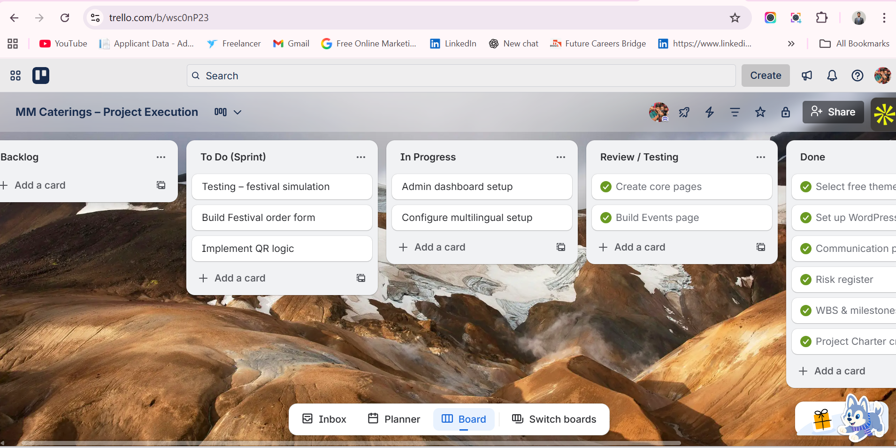
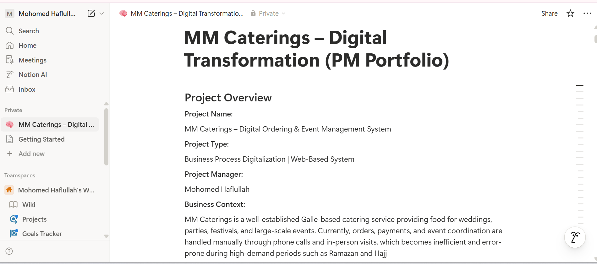
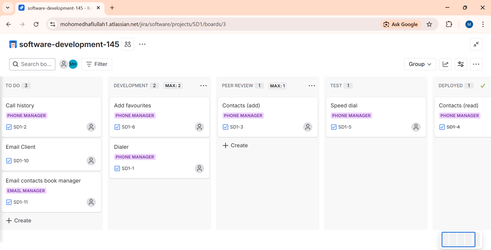
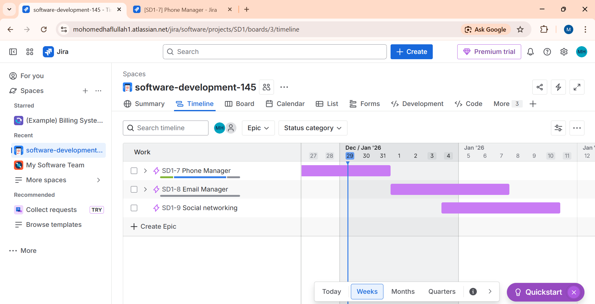

# Mohomed Haflullah

**Project Management Intern | Agile & PMO Support**  
Cross-Functional Delivery | Agile Coordination | Digital Transformation Projects  
📧 mohomedhaflullah@gmail.com | 🔗 [LinkedIn](https://www.linkedin.com/in/mohomedhaflullah) | 🌐 [Portfolio](https://haflullah.github.io)

---

## About Me

I am an early-career Project Management professional with hands-on experience in Agile delivery support, PMO coordination, and client-facing digital transformation projects.

My background spans IT project coordination, stakeholder communication, and operational management - giving me a practical, structured approach to keeping projects on track and teams aligned. I have supported cross-functional teams, managed async workflows, and maintained delivery documentation across fast-paced, distributed environments.

I thrive in structured, collaborative settings where clear communication, organised execution, and proactive problem-solving drive results.

**Currently seeking:** Junior PM · Scrum Support · PMO Coordination · Project Coordinator roles  
**Available for:** Full-time · Part-time · Contract · Internship  
**Timezone:** GMT+5:30 | Flexible to align with EU and US working hours

---

## Core Competencies

- **Methodologies:** Agile, Scrum, Kanban
- **Tools:** Jira, Trello, Notion, Slack, MS Office (Excel, Word, PowerPoint), WordPress
- **PM Skills:** Backlog Management, Sprint Planning, RAID Logs, Status Reporting, Risk Tracking, Change Management
- **Soft Skills:** Async & Sync Communication, Cross-functional Collaboration, Stakeholder Management, Active Listening
- **Languages:** English (Professional), Tamil (Native), Sinhala (Native)

---

## Projects

### MM Caterings – Client Digital Transformation Project

> **Real client delivery** for a local catering business, focused on digitising event order management and large-scale festival food distribution using zero-cost tools.

**Challenge:** The client had no digital system for managing event orders or tracking festival distribution (Ramazan & Hajj Biriyani Sahan), leading to operational delays and order errors.

**What I Did:**
- Conducted stakeholder interviews to gather requirements and define project scope, risks, and success criteria
- Built a multilingual (English & Sinhala) WordPress customer platform with integrated order forms (WPForms)
- Designed a QR-based order verification system for festival-day distribution tracking
- Managed the full project lifecycle using Agile practices — Trello board (Backlog → Sprint → Review → Done)
- Maintained structured documentation in Notion: project charter, risk register, sprint notes, and closure report
- Conducted functional testing and operational simulation before go-live

**Result:** Project delivered on time before the Ramazan festival deadline. Client successfully adopted the digital platform for order intake and QR-based distribution - eliminating manual, paper-based errors entirely.

**Skills:** Project Coordination · Stakeholder Management · Trello · Notion · WordPress · Agile Delivery

 

<em>Trello board used for backlog management, sprint execution, review, and delivery tracking.</em>

 

<em>Notion workspace used for project charter creation, documentation, and lifecycle tracking.</em>

---

### Agile Lifecycle Execution & Jira Project Setup

> Enterprise-style Agile delivery simulation - translating Agile theory into structured, tool-based execution using Jira.

**What I Did:**
- Configured Jira project with structured workflows, quality gates, and deployment controls
- Applied WIP limits to improve flow efficiency and reduce delivery bottlenecks
- Managed backlog prioritisation, issue tracking, and sprint-style execution
- Practised delivery readiness checks, status transitions, and sprint reporting

**Skills:** Jira · Agile Methodology · Kanban · Workflow Management · Backlog Prioritisation

 

<em>Jira Kanban board showing workflow stages, WIP limits, and task progression.</em>

 

<em>Timeline view illustrating epic-level planning and delivery tracking.</em>

---

### Personal Agile Sprint Practice – Trello

> Self-directed sprint execution to build delivery discipline and consistent workflow habits.

- Ran full sprint cycles: planning → execution → review → retrospective
- Tracked tasks using a Kanban board with clear swimlanes and priorities
- Built personal delivery accountability and task ownership habits

**Skills:** Trello · Kanban · Sprint Planning · Self-Management

---

## Professional Experience

### Intern Scrum Master
**Digital Nexus AI** | *Oct 2025 – Present*

- Facilitated Agile ceremonies - daily stand-ups, sprint planning, reviews, and retrospectives - ensuring full team alignment across cross-functional groups
- Tracked tasks, dependencies, and blockers using Trello and Agile tools, reducing delivery bottlenecks
- Maintained sprint documentation and delivery status updates for digital and AI-focused initiatives
- Coordinated async and sync workflows across distributed teams spanning multiple time zones

---

### Project Management Intern
**Theory to Trade** | *Oct 2025 – Present*

- Coordinated progress tracking across 5+ concurrent project teams
- Maintained RAID logs, action logs, and status reports for hybrid delivery teams
- Supported change management and stakeholder communication between business and technical stakeholders
- Monitored risks and dependencies to support on-time delivery in a structured, fast-paced PM environment

---

### Event Manager & Front Office Operations
**Villa Upper Dickson** | *Nov 2024 – Sep 2025*

- Managed end-to-end event logistics - planning, vendor coordination, timeline management, and on-site execution
- Handled guest communication, scheduling, and operational workflows under strict time and quality constraints
- Demonstrated practical project management skills in a high-pressure, client-facing environment

---

### Bellperson
**Villa Upper Dickson** | *Jan 2021 – Nov 2023*

- Delivered consistent, high-quality service over nearly 3 years in a fast-paced hospitality environment
- Coordinated arrivals, departures, and guest logistics — building strong reliability and communication discipline

---

## Education

**Bachelor of Science in Information Technology**  
Rajarata University | *Sep 2022 – Apr 2026 (Expected)*

---

## Certifications

| Certification | Issuer | Credential |
|---|---|---|
| Foundations of Project Management | Google / Coursera | [Verify](https://www.coursera.org/account/accomplishments/verify/5CSZMS7ZSA7H) |
| Get Started with Jira (Project) | Coursera | [Verify](https://www.coursera.org/account/accomplishments/verify/JBRYA3RQMT3W) |
| Introduction to Jira | Coursera | [Verify](https://www.coursera.org/account/accomplishments/verify/IH6G6VVVMGJJ) |
| Scrum Fundamentals Certified (SFC) | SCRUMstudy | [Verify](https://www.scrumstudy.com/certification/verify?type=SFC&number=1111419) |
| Google AI Essentials | Google / Coursera | [Verify](https://www.coursera.org/account/accomplishments/specialization/B4XS7Q5WCULL) |
| Python for Data Science, AI & Development | Coursera | [Verify](https://www.coursera.org/account/accomplishments/verify/4S0XTFE4UH91) |

---

## Contact

- 📧 **Email:** mohomedhaflullah@gmail.com
- 🔗 **LinkedIn:** [linkedin.com/in/mohomedhaflullah](https://www.linkedin.com/in/mohomedhaflullah)
- 🌐 **Portfolio:** [haflullah.github.io](https://haflullah.github.io)
- 📍 **Based in:** South Asia | Open to opportunities globally
